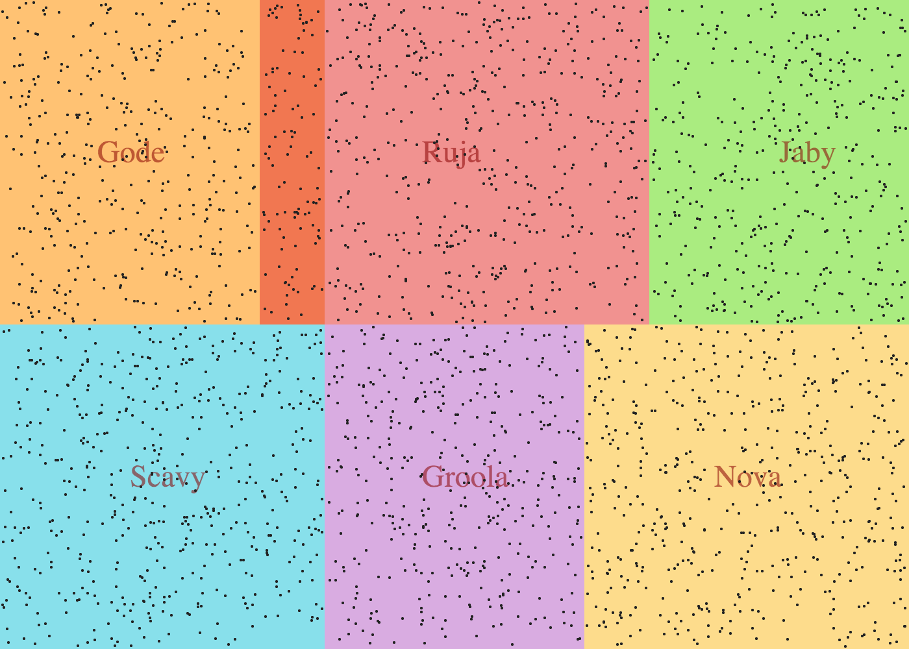

# Desafio back-end

## Sobre o desafio


Dependendo da sua experiência e/ou das ferramentas escolhidas, você pode precisar de mais ou de menos tempo para realizar o desafio.

Para isso, vamos fornecer para você alguns dados. Neste [json](properties.json) você encontra milhares de imóveis listados com a seguinte estrutura:

```javascript
{
  "totalProperties": 1, // total number of properties on this json
  "properties": [ // array of properties
    {
      "id": 1, // id :P
      "title": "Imóvel código 1, com 5 quartos e 4 banheiros", // property title
      "price": 1250000, // price
      "description": "Lorem ipsum dolor sit amet, consectetur adipiscing elit.", // description
      "x": 870, // lat (Spotippos geographic coordinate)
      "y": 867, // long (Spotippos geographic coordinate)
      "beds": 5, // number of beds
      "baths": 4, // number of baths
      "provinces" : ["Scavy"], // spotippos provinces
      "squareMeters": 134
    }
  ]
}
```

Esses imóveis são representados no mapa de Spotippos da seguinte forma:



## Desafio

Em Spotippos temos as seguintes regras:

1. A área total de Spotippos é definida da seguinte forma `0 <= x <= 1400` e `0 <= y <= 1000`, e a delimitação de suas províncias são encontradas neste [json](provinces.json).
2. Um imóvel em Spotippos tem as seguintes características:
  - No máximo 5 quartos (beds), e no mínimo 1
  - No máximo 4 banheiros (baths), e no mínimo 1
  - No máximo 240 metros quadrados, e no mínimo 20

Usando as informações anteriores, crie uma API REST que execute as funções abaixo. Você pode fazer tudo em memória, ou seja, não precisa utilizar nenhum banco de dados ou ferramenta. Se você preferir, se sentir mais confortável ou achar mais fácil, fique a vontade! ;)

### 1. Crie imóveis em Spotippos :)

A partir da estrutura abaixo em `Request` e `Body` permita a criação de um imóvel. Todos os campos são obrigatórios e devem respeitar as regras enunciadas neste desafio e nos limites geográficos de Spottipos.

Request:
```
POST /properties
```

Body:
```json
{
  "x": 222,
  "y": 444,
  "title": "Imóvel código 1, com 5 quartos e 4 banheiros",
  "price": 1250000,
  "description": "Lorem ipsum dolor sit amet, consectetur adipiscing elit.",
  "beds": 4,
  "baths": 3,
  "squareMeters": 210
}
```

Response:

Você define, faz parte da avaliação.

### 2. Mostre um imóvel específico em Spotippos =]

Busque um imóvel específico a partir de seu `id`.

Request:
```
  GET /properties/{id}
```

Response:

```json
{
  "id": 665,
  "title": "Imóvel código 665, com 1 quarto e 1 banheiro",
  "price": 540000,
  "description": "Lorem ipsum dolor sit amet, consectetur adipiscing elit.",
  "x": 667,
  "y": 556,
  "beds": 1,
  "baths": 1,
  "provinces" : ["Ruja"],
  "squareMeters": 42
}
```

### 3. Busque imóveis em Spotippos :D

Dado um retângulo representado pelos pontos A e B, onde A é o ponto superior esquerdo e B é o ponto inferior direito, queremos saber quais imóveis estão contidos nessa área. Cada ponto é representado pelas cordenadas `x` e `y`. O ponto A é representado por `ax` e `ay` e B por `bx` e `by`.

Sendo assim, a estrutura da url de requisição para esta busca que esperamos deve seguir o formato:

Request:
```
  GET /properties?ax={integer}&ay={integer}&bx={integer}&by={integer}
```

Response:

```json
{
  "foundProperties": 3,
  "properties": [
    {
      "id": 34,
      "title": "Imóvel código 34, com 4 quartos e 3 banheiros",
      "price": 1250000,
      "description": "Lorem ipsum dolor sit amet, consectetur adipiscing elit.",
      "x": 999,
      "y": 333,
      "beds": 4,
      "baths": 3,
      "squareMeters": 237,
      "provinces" : ["Scavy", "Gode"]
    },
    {"..."},
    {"..."}
  ]
}
```

### 4. Wow! Agora temos que fazer deploy! :D

Crie uma documentação de como rodar o seu projeto! Quanto mais simples, melhor! =D

## Modo de avaliação

Nós sempre avaliamos o seu código, e para isso nós envolvemos sempre no mínimo 3 engenheiros aqui do Viva e amigavelmente informamos que iremos nos basear pelos seguintes critérios:

* **Manutenibilidade:** O código é legível e de fácil manutenção?
* **Desenho:** Como foram separadas as responsabilidades? Quais técnicas foram utilizadas?
* **Qualidade:** Tem testes? Quão difícil é recriar os testes caso seja necessário alterar o comportamento da aplicação?
* **Desempenho:** Escreveu um código com performance adequada? Não precisa ser perfeito, mas entende como seria a melhor solução?

Fique a vontade para incrementar seu desafio de modo a demonstrar como o resultado do seu esforço pode deixá-lo ainda melhor!

Bom código! ;)
