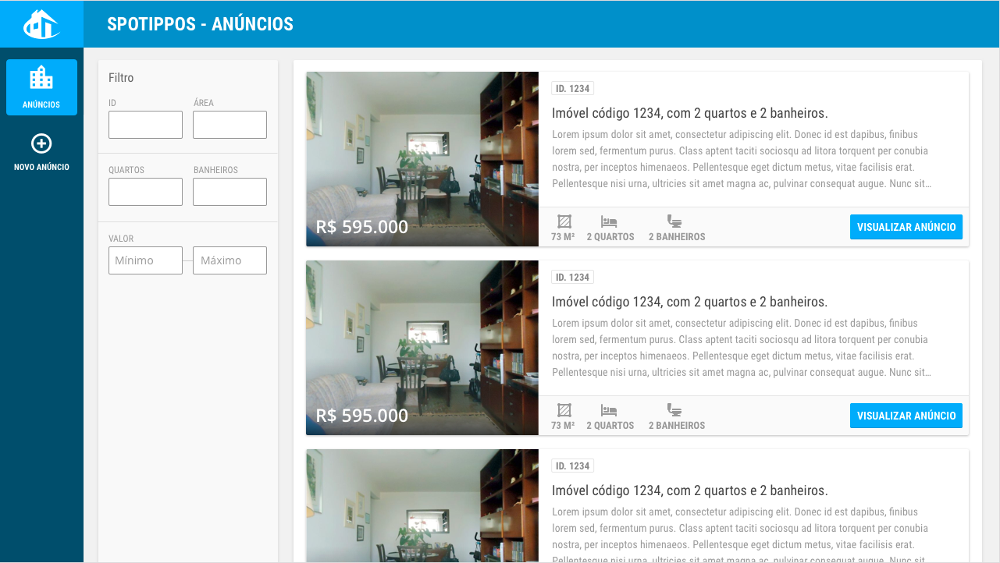

# Desafio front-end

## Sobre o desafio

Dependendo da sua experiência e/ou das ferramentas escolhidas, você pode precisar de mais ou menos tempo para realizar o desafio.


## Dados
Para auxiliá-lo, forneceremos alguns dados importantes:

###Layout do site
Layout do site Spotippos no zeplin:
  - Vá ao [zeplin.io](https://zeplin.io/)
  - Logue com os dados - user: frontendtest senha: frontendtest



###API para integração

Nossa API terá dados no seguinte formato [deste](properties.json) json.

####Ler um imóvel por ID:
```
GET http://spotippos.vivareal.com/properties/1
```

####Buscar imóveis entre 2 coordenadas:
```
GET http://spotippos.vivareal.com/properties?ax=1&ay=1&bx=20&by=20
```

## Desafio

Sua missão é criar uma página de resultados como todos os anúncios de imóveis de Spotippos. Vamos lá, a sua página não pode ser apenas estática, ela precisa de alguma inteligência para que todos os imóveis sejam exibidos dinamicamente. Ela ficará ainda mais legal, se os filtros funcionarem, pois eles ajudarão as pessoas a encontrarem o imóvel dos seus sonhos em Spotippos.

### 1. Desenvolver a página de resultados

Crie um template estático, baseado no layout fornecido, atendendo aos seguintes critérios:
 
 - garanta que seu código HTML é o mais semântico possível
 - utilize alguma metodologia para organização do seu código CSS
 - enriqueça seu código objetivando a melhor indexação possível 
 - faça com que sua página traga uma experiência agradável a qualquer pessoa, independentemente do dispositivo que ela estiver utilizando para ver sua página

### 2. Faça seu template ganhar vida

Integre seu template a nossa API, obedecendo aos seguintes critérios:

  - a integração deve ser feita tendo como base Javascript
  - para facilitar utilize algum framework MV* de mercado **ou** utilize Vanilla JS para integração (se utilizar algum template engine será considerado um plus)

### 3. Ajude seus usuários a refinar os resultados

Enriqueça ainda mais a experiência dos usuários, permitindo que estes busquem imóveis utilizando os filtros previstos no layout. Tente facilitar ao máximo o preenchimento das informações nos campos, prevenindo que dados sem sentido sejam inseridos. A propósito é um bom momento para garantir que essas funcionalidades sejam livres de bugs, então se você puder adicionar testes automatizados (end to end, unitários, o que você preferir) no projeto seria uma boa!

### 4. Wow! Agora temos que fazer deploy! :D

Crie uma documentação de como rodar o seu projeto! Quanto mais simples ela for, melhor! =D
